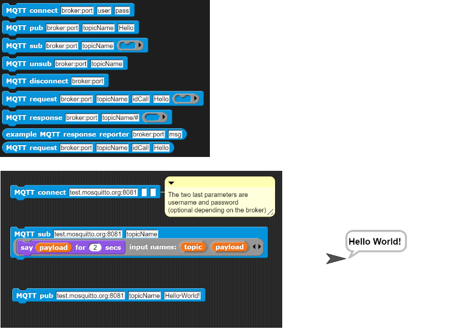
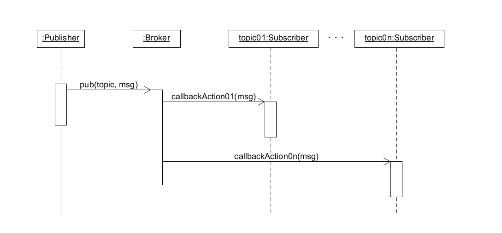

# MQTT4Snap *!*

MQTT4Snap *!*  is a Snap *!*  library for using [MQTT](https://en.wikipedia.org/wiki/MQTT) in [Snap *!*](http://snap.berkeley.edu) and [Snap4Arduino](http://snap4arduino.rocks).

The default broker is  [test.mosquitto.org](https://test.mosquitto.org), but it is recommended to use your own broker. [Mosquitto](https://mosquitto.org) is a popular open-source option, and the [WebSockets feature must be activated](http://www.steves-internet-guide.com/mqtt-websockets) for MQTT4Snap *!* to work. The [MQTT Explorer](http://mqtt-explorer.com) tool is an excellent tool for monitoring broker activity.

## [Hello World!](https://snap.berkeley.edu/snap/snap.html#open:https://raw.githubusercontent.com/pixavier/mqtt4snap/master/HelloWorld.xml)

Here you can run our [Hello World!](https://snap.berkeley.edu/snap/snap.html#open:https://raw.githubusercontent.com/pixavier/mqtt4snap/master/HelloWorld.xml) example of MQTT4Snap *!*

## Usage and blocks

If you just want to import the MQTT4Snap *!* blocks library, select and copy the following URL to the clipboard, and then paste it when importing into Snap *!*:

    https://raw.githubusercontent.com/pixavier/mqtt4snap/master/mqtt-standalone.xml

##
Here you can see the blocks and a minimum example:
###

### pub / sub blocks

The **pub** and **sub** blocks are suitable for PubSub architecture based implementations.

### request / response blocks

The **request** and **response** blocks are suitable for an asynchronous client-server architectural approach on a PubSub based infrastructure.

PubSub architectures, with a one-time subscription, can be considered as a generalization of Client-server architectures.

### request reporter block

The **request** block is suitable for a synchronous client-server architectural approach on a PubSub based infrastructure.

PubSub architectures, with a one-time subscription and a response waiting semaphore based mechanism, can be considered as a generalization of synchronous Client-server architectures. 

The waiting semaphore can be improved adding timeout management.

### disconnect block

The **disconnect** block accepts the value **all** as a parameter, and then it closes all existing connections to MQTT brokers.

## Acknowledgents

Of course, this project wouldn't exist without:

- [MQTT.js](https://github.com/mqttjs/MQTT.js)
- The "fetch JavaScript" block from [Bernat Romagosa](https://github.com/bromagosa)
- The mqttWildcard matching function, adapted from [https://github.com/hobbyquaker/mqtt-wildcard] 

